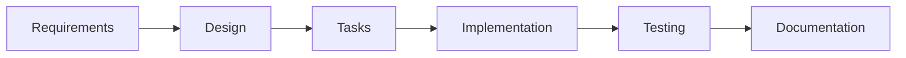

# Runtime Code Experiment

## Overview

This repository contains experiments for building a text-to-code execution system that will eventually evolve into an AI-driven game control mechanism. The goal is to explore how natural language instructions can be converted to executable code that controls game entities and environments.

**Current Status**: Implementing code execution POC (Task 1 ✅ complete, starting Task 2)

## Long-term Vision

1. **Text Instructions** → **LLM Code Generation** → **Game Control**
2. Target: 2D top-down game controlled through natural language
3. Example: "Move character north 3 steps" → Generated code → Character movement

## Current Features

### 01 - Code Execution POC (`specs/01-code-execution-poc/`)
A WebSocket-based proof of concept for:
- Web UI for typing JavaScript code
- Node.js server that executes code using `eval()`
- Real-time console output streaming back to UI
- Foundation for future game state manipulation

## Spec-Driven Development Process

This repository follows a **spec-driven development** approach documented in `docs/feature_development_process.md`. Each feature follows this gated process:

1. **Requirements** (`requirements.md`) → Review & Approve → Git Commit
2. **Design** (`design.md`) → Review & Approve → Git Commit  
3. **Tasks** (`tasks.md`) → Review & Approve → Git Commit
4. **Implementation** → Validation against specs

### 📁 Repository Structure

```
.
├── specs/                          # Feature specifications (numbered chronologically)
│   ├── 00-example-feature/         # Example feature structure
│   ├── 01-code-execution-poc/      # Current: Code execution proof-of-concept
│   └── common/                     # Shared specifications & standards
├── src/                            # Application source code (future)
├── tests/                          # All types of tests (future)
├── docs/                           # Process documentation
│   ├── feature_development_process.md  # Development workflow
│   └── api_documentation.md        # API docs (future)
└── README.md                       # This file
```

## Getting Started

### Running Current Features
**Prerequisites**: Node.js and npm (installed via Homebrew)

**Project Setup** (Task 1 Complete):
- `npm install` - Install dependencies (ws, jest)
- `npm test` - Run test suite (currently empty, exits successfully)
- `npm start` - Start server (implementation in progress)

### Creating New Features
Follow the process documented in `docs/feature_development_process.md`:

1. Create numbered feature directory: `specs/NN-feature-name/`
2. Document requirements → Get approval → Commit
3. Document design → Get approval → Commit
4. Plan tasks → Get approval → Commit
5. Implement

## Development Notes

- **POC Focus**: Current implementations prioritize simplicity and learning over production quality
- **Local Only**: All experiments run locally, no deployment considerations
- **Throwaway Code**: POC implementations will be discarded as we iterate toward the final vision
- **Test-Driven Development**: Unit tests for core logic, manual testing for end-to-end validation
- **Incremental Implementation**: Tasks completed one-by-one with checkmark-level review cycles
   touch specs/your-feature-name/design.md
   touch specs/your-feature-name/tasks.md
   ```

3. **Follow the specification workflow**:
   - Start with `requirements.md` (WHAT needs to be built)
   - Move to `design.md` (HOW it will be built)
   - Break it down in `tasks.md` (concrete implementation steps)

#### 2. Specification Workflow



### 📝 Specification Templates

Each feature directory should contain:

#### requirements.md
- User stories and personas
- Acceptance criteria (preferably in EARS format)
- Business requirements and constraints
- Success metrics

#### design.md
- System architecture and components
- Data models and schemas
- API interfaces and contracts
- Technology choices and rationale
- Security and performance considerations

#### tasks.md
- Concrete, actionable implementation tasks
- Task dependencies and ordering
- Estimated effort and complexity
- Assignment and tracking information

### 🔄 Development Process

1. **Specification Phase**: Write comprehensive specs before any code
2. **Review Phase**: Team reviews and approves specifications
3. **Implementation Phase**: Code according to the approved specs
4. **Testing Phase**: Validate implementation against acceptance criteria
5. **Documentation Phase**: Update user-facing docs as needed

### 🎯 Benefits of This Approach

- **Clarity**: Everyone knows what's being built and why
- **Traceability**: Code changes can be traced back to requirements
- **Quality**: Specifications serve as a quality gate
- **Knowledge Sharing**: New team members can understand decisions
- **Maintenance**: Future changes are easier with documented architecture

### 📚 Additional Resources

- [Specification Writing Guidelines](specs/common/shared_definitions.md)
- [API Documentation](docs/api_documentation.md)
- [User Manual](docs/user_manual.md)

### 🤝 Contributing

1. Follow the spec-driven development process
2. Ensure all specifications are complete before implementation
3. Keep specifications updated as requirements evolve
4. Write tests that validate against the acceptance criteria

---

**Remember**: In spec-driven development, the specification is the source of truth. Code implements the spec, not the other way around.
