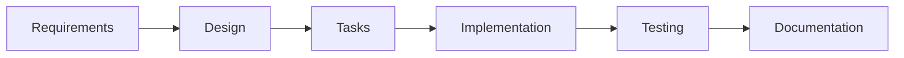

# Runtime Code 

## Spec-Driven Development Process:

This repository follows a **spec-driven development** approach, where specifications are the central, version-controlled artifacts that drive the entire development process.

### 🎯 Philosophy

Spec-driven development ensures that:
- Requirements are clearly defined before implementation begins
- Design decisions are documented and traceable
- Implementation tasks are broken down systematically
- Code is validated against well-defined specifications
- Knowledge is preserved and shared across the team

### 📁 Repository Structure

```
.
├── specs/                          # Core specifications directory
│   ├── <feature-or-module-name>/   # Feature-specific specifications
│   │   ├── requirements.md         # User stories & acceptance criteria
│   │   ├── design.md              # Technical architecture & design
│   │   └── tasks.md               # Implementation task breakdown
│   └── common/                    # Shared specifications
│       └── shared_definitions.md  # Common definitions & standards
├── src/                           # Application source code
├── tests/                         # All types of tests
├── docs/                          # Generated/derived documentation
│   ├── api_documentation.md       # API documentation
│   └── user_manual.md            # End-user documentation
├── .gitignore                     # Git ignore patterns
├── README.md                      # This file
└── package.json                   # Project dependencies & scripts
```

### 🚀 Getting Started

#### 1. Creating a New Feature

When starting a new feature or module:

1. **Create a new directory** under `specs/` with a descriptive name:
   ```bash
   mkdir specs/your-feature-name
   ```

2. **Create the three core specification files**:
   ```bash
   touch specs/your-feature-name/requirements.md
   touch specs/your-feature-name/design.md
   touch specs/your-feature-name/tasks.md
   ```

3. **Follow the specification workflow**:
   - Start with `requirements.md` (WHAT needs to be built)
   - Move to `design.md` (HOW it will be built)
   - Break it down in `tasks.md` (concrete implementation steps)

#### 2. Specification Workflow



### 📝 Specification Templates

Each feature directory should contain:

#### requirements.md
- User stories and personas
- Acceptance criteria (preferably in EARS format)
- Business requirements and constraints
- Success metrics

#### design.md
- System architecture and components
- Data models and schemas
- API interfaces and contracts
- Technology choices and rationale
- Security and performance considerations

#### tasks.md
- Concrete, actionable implementation tasks
- Task dependencies and ordering
- Estimated effort and complexity
- Assignment and tracking information

### 🔄 Development Process

1. **Specification Phase**: Write comprehensive specs before any code
2. **Review Phase**: Team reviews and approves specifications
3. **Implementation Phase**: Code according to the approved specs
4. **Testing Phase**: Validate implementation against acceptance criteria
5. **Documentation Phase**: Update user-facing docs as needed

### 🎯 Benefits of This Approach

- **Clarity**: Everyone knows what's being built and why
- **Traceability**: Code changes can be traced back to requirements
- **Quality**: Specifications serve as a quality gate
- **Knowledge Sharing**: New team members can understand decisions
- **Maintenance**: Future changes are easier with documented architecture

### 📚 Additional Resources

- [Specification Writing Guidelines](specs/common/shared_definitions.md)
- [API Documentation](docs/api_documentation.md)
- [User Manual](docs/user_manual.md)

### 🤝 Contributing

1. Follow the spec-driven development process
2. Ensure all specifications are complete before implementation
3. Keep specifications updated as requirements evolve
4. Write tests that validate against the acceptance criteria

---

**Remember**: In spec-driven development, the specification is the source of truth. Code implements the spec, not the other way around.
