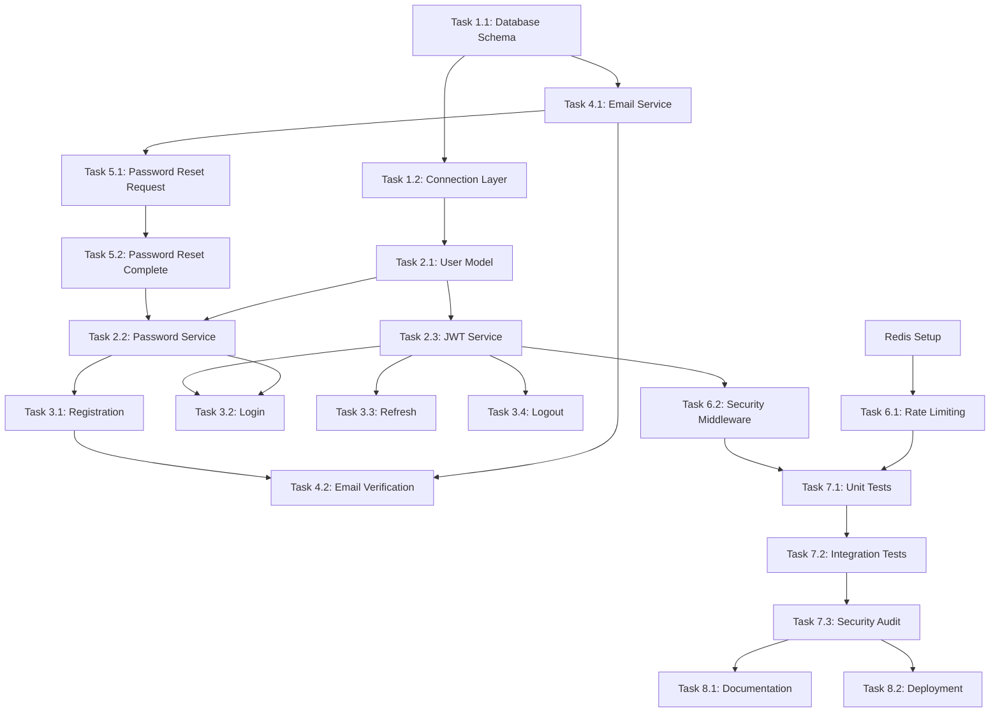

# User Authentication - Implementation Tasks

_NOTE: This is an example and does NOT reflect an actual implementation in this repository._

## Task Overview

This document breaks down the user authentication feature into concrete, actionable implementation tasks. Tasks are organized by logical groups and include dependencies, effort estimates, and completion criteria.

## Sprint Planning

### Sprint 1: Foundation (Week 1)
- Database setup and migrations
- Core authentication models
- Basic API endpoints structure

### Sprint 2: Core Authentication (Week 2)
- Registration and login functionality
- Password security implementation
- JWT token management

### Sprint 3: Enhanced Security (Week 3)
- Rate limiting and account lockout
- Email verification system
- Password reset functionality

### Sprint 4: Testing & Polish (Week 4)
- Comprehensive testing
- Security auditing
- Documentation and deployment

## Task Breakdown

### Phase 1: Database Foundation

#### Task 1.1: Database Schema Setup
**Priority**: High  
**Estimated Effort**: 6 hours  
**Dependencies**: None  
**Assignee**: Backend Developer  

**Description**: Create PostgreSQL database schema for user authentication system including all tables, indexes, and constraints.

**Acceptance Criteria**:
- [ ] Users table created with all required fields
- [ ] Authentication logs table created
- [ ] Password reset tokens table created
- [ ] Email verification tokens table created
- [ ] All indexes created for optimal query performance
- [ ] Foreign key constraints properly defined
- [ ] Migration scripts written and tested

**Technical Notes**:
- Use UUID for primary keys
- Ensure email field has unique constraint
- Add proper indexes for frequently queried fields
- Consider database connection pooling requirements

**Definition of Done**:
- [ ] Database schema deployed to development environment
- [ ] Migration scripts tested and documented
- [ ] Database connection verified from application
- [ ] Schema review completed and approved

---

#### Task 1.2: Database Connection Layer
**Priority**: High  
**Estimated Effort**: 4 hours  
**Dependencies**: Task 1.1  
**Assignee**: Backend Developer  

**Description**: Implement database connection layer with connection pooling and error handling.

**Acceptance Criteria**:
- [ ] Database connection pool configured
- [ ] Connection health checks implemented
- [ ] Graceful connection failure handling
- [ ] Environment-specific configuration
- [ ] Connection monitoring and logging

**Technical Notes**:
- Use environment variables for database credentials
- Implement retry logic for connection failures
- Set appropriate pool size limits
- Add connection timeout configurations

**Definition of Done**:
- [ ] Database connection layer implemented
- [ ] Unit tests written and passing
- [ ] Connection tested in development environment
- [ ] Error handling verified

---

### Phase 2: Core Models and Services

#### Task 2.1: User Model Implementation
**Priority**: High  
**Estimated Effort**: 8 hours  
**Dependencies**: Task 1.1, Task 1.2  
**Assignee**: Backend Developer  

**Description**: Implement User model with all CRUD operations, validation, and business logic.

**Acceptance Criteria**:
- [ ] User model class implemented with TypeScript interfaces
- [ ] Email validation logic implemented
- [ ] Password strength validation implemented
- [ ] User creation, update, and retrieval methods
- [ ] Account status management (active/inactive)
- [ ] Failed login attempt tracking
- [ ] Account lockout logic implemented

**Technical Notes**:
- Use strong typing with TypeScript
- Implement proper validation using Joi or similar
- Ensure email format validation follows RFC 5322
- Password validation according to requirements

**Definition of Done**:
- [ ] User model implemented with full type safety
- [ ] All validation rules implemented and tested
- [ ] Unit tests written for all methods
- [ ] Integration tests with database completed
- [ ] Code review completed

---

#### Task 2.2: Password Security Service
**Priority**: High  
**Estimated Effort**: 6 hours  
**Dependencies**: Task 2.1  
**Assignee**: Backend Developer  

**Description**: Implement secure password hashing and verification using bcrypt.

**Acceptance Criteria**:
- [ ] Password hashing service implemented with bcrypt
- [ ] Cost factor set to minimum 12
- [ ] Password verification method implemented
- [ ] Secure password comparison (timing attack resistant)
- [ ] Password history tracking (optional enhancement)

**Technical Notes**:
- Never store plaintext passwords
- Use async bcrypt methods to avoid blocking
- Implement proper error handling for hashing failures
- Consider implementing password complexity scoring

**Definition of Done**:
- [ ] Password service implemented and tested
- [ ] Security review completed
- [ ] Performance benchmarks measured
- [ ] Unit tests cover all edge cases

---

#### Task 2.3: JWT Token Service
**Priority**: High  
**Estimated Effort**: 8 hours  
**Dependencies**: Task 2.1  
**Assignee**: Backend Developer  

**Description**: Implement JWT token generation, validation, and refresh functionality.

**Acceptance Criteria**:
- [ ] JWT token generation with proper payload
- [ ] Token signing with secure secret key
- [ ] Token validation and verification
- [ ] Refresh token functionality implemented
- [ ] Token blacklist/revocation system
- [ ] Proper expiration handling

**Technical Notes**:
- Use HS256 algorithm for signing
- Generate secure random secret key
- Implement proper token rotation
- Store refresh tokens securely

**Definition of Done**:
- [ ] JWT service fully implemented
- [ ] Token security verified
- [ ] Unit tests cover all token operations
- [ ] Integration tests with authentication flow

---

### Phase 3: API Endpoints

#### Task 3.1: User Registration Endpoint
**Priority**: High  
**Estimated Effort**: 10 hours  
**Dependencies**: Task 2.1, Task 2.2  
**Assignee**: Backend Developer  

**Description**: Implement user registration API endpoint with validation and email verification.

**Acceptance Criteria**:
- [ ] POST /api/auth/register endpoint implemented
- [ ] Request validation implemented
- [ ] Duplicate email handling
- [ ] Password strength validation
- [ ] Email verification token generation
- [ ] Success response with user data (no password)
- [ ] Proper error responses for all failure cases

**Technical Notes**:
- Validate all input data before processing
- Return consistent error response format
- Log registration attempts for monitoring
- Implement rate limiting per IP

**Definition of Done**:
- [ ] Registration endpoint fully functional
- [ ] All validation rules implemented
- [ ] Unit tests for all scenarios
- [ ] Integration tests with database
- [ ] API documentation updated

---

#### Task 3.2: User Login Endpoint
**Priority**: High  
**Estimated Effort**: 12 hours  
**Dependencies**: Task 2.1, Task 2.2, Task 2.3  
**Assignee**: Backend Developer  

**Description**: Implement user login API endpoint with authentication and token generation.

**Acceptance Criteria**:
- [ ] POST /api/auth/login endpoint implemented
- [ ] Email and password validation
- [ ] Failed login attempt tracking
- [ ] Account lockout enforcement
- [ ] JWT token generation on success
- [ ] Refresh token generation
- [ ] Authentication logging
- [ ] Proper error responses

**Technical Notes**:
- Implement constant-time password comparison
- Track failed attempts per user account
- Implement progressive delay for repeated failures
- Log all authentication attempts

**Definition of Done**:
- [ ] Login endpoint fully functional
- [ ] Security measures implemented and tested
- [ ] Rate limiting configured
- [ ] Comprehensive test coverage
- [ ] Performance benchmarks met

---

#### Task 3.3: Token Refresh Endpoint
**Priority**: Medium  
**Estimated Effort**: 6 hours  
**Dependencies**: Task 2.3, Task 3.2  
**Assignee**: Backend Developer  

**Description**: Implement token refresh endpoint for seamless session management.

**Acceptance Criteria**:
- [ ] POST /api/auth/refresh endpoint implemented
- [ ] Refresh token validation
- [ ] New access token generation
- [ ] Token rotation (optional)
- [ ] Expired token handling
- [ ] Security logging

**Technical Notes**:
- Validate refresh token before generating new access token
- Consider implementing refresh token rotation
- Handle edge cases for expired or invalid tokens

**Definition of Done**:
- [ ] Refresh endpoint implemented
- [ ] Token rotation tested
- [ ] Security validation completed
- [ ] Unit and integration tests passing

---

#### Task 3.4: Logout Endpoint
**Priority**: Medium  
**Estimated Effort**: 4 hours  
**Dependencies**: Task 2.3  
**Assignee**: Backend Developer  

**Description**: Implement logout endpoint with token invalidation.

**Acceptance Criteria**:
- [ ] POST /api/auth/logout endpoint implemented
- [ ] Token blacklisting/invalidation
- [ ] Session cleanup
- [ ] Logout logging
- [ ] Proper response format

**Technical Notes**:
- Add tokens to blacklist or invalidation store
- Clean up any server-side session data
- Consider cleanup of expired blacklisted tokens

**Definition of Done**:
- [ ] Logout endpoint functional
- [ ] Token invalidation verified
- [ ] Session cleanup tested
- [ ] Integration tests passing

---

### Phase 4: Email Verification System

#### Task 4.1: Email Service Integration
**Priority**: High  
**Estimated Effort**: 8 hours  
**Dependencies**: Task 1.1  
**Assignee**: Backend Developer  

**Description**: Implement email service for sending verification and password reset emails.

**Acceptance Criteria**:
- [ ] Email service configuration and setup
- [ ] SMTP connection and authentication
- [ ] Email template system
- [ ] HTML and plain text email support
- [ ] Error handling for email failures
- [ ] Email sending rate limiting

**Technical Notes**:
- Use environment variables for SMTP configuration
- Implement email queue for better performance
- Create reusable email templates
- Handle temporary email service failures gracefully

**Definition of Done**:
- [ ] Email service implemented and tested
- [ ] Email templates created
- [ ] Error handling tested
- [ ] Integration tests with external service

---

#### Task 4.2: Email Verification Flow
**Priority**: High  
**Estimated Effort**: 10 hours  
**Dependencies**: Task 4.1, Task 3.1  
**Assignee**: Backend Developer  

**Description**: Implement complete email verification workflow.

**Acceptance Criteria**:
- [ ] Verification token generation and storage
- [ ] Verification email sending on registration
- [ ] Email verification endpoint (GET /api/auth/verify-email/:token)
- [ ] Token expiration handling (24 hours)
- [ ] User account activation on verification
- [ ] Resend verification email functionality

**Technical Notes**:
- Generate cryptographically secure verification tokens
- Set appropriate token expiration times
- Handle already verified accounts gracefully
- Implement token cleanup for expired tokens

**Definition of Done**:
- [ ] Complete verification flow implemented
- [ ] Token security verified
- [ ] Email delivery tested
- [ ] Edge cases handled
- [ ] Integration tests passing

---

### Phase 5: Password Reset System

#### Task 5.1: Password Reset Request
**Priority**: Medium  
**Estimated Effort**: 8 hours  
**Dependencies**: Task 4.1  
**Assignee**: Backend Developer  

**Description**: Implement password reset request functionality.

**Acceptance Criteria**:
- [ ] POST /api/auth/password-reset/request endpoint
- [ ] Reset token generation and storage
- [ ] Password reset email sending
- [ ] Token expiration (1 hour)
- [ ] Rate limiting for reset requests
- [ ] Security logging

**Technical Notes**:
- Generate secure random reset tokens
- Implement rate limiting per email address
- Log all password reset requests
- Handle non-existent email addresses securely

**Definition of Done**:
- [ ] Password reset request implemented
- [ ] Rate limiting configured
- [ ] Security measures tested
- [ ] Email delivery verified

---

#### Task 5.2: Password Reset Completion
**Priority**: Medium  
**Estimated Effort**: 8 hours  
**Dependencies**: Task 5.1, Task 2.2  
**Assignee**: Backend Developer  

**Description**: Implement password reset completion functionality.

**Acceptance Criteria**:
- [ ] POST /api/auth/password-reset/complete endpoint
- [ ] Reset token validation
- [ ] New password validation and hashing
- [ ] Token consumption (one-time use)
- [ ] Account unlock on successful reset
- [ ] Confirmation email sending

**Technical Notes**:
- Validate new password against strength requirements
- Ensure tokens can only be used once
- Unlock account if it was locked due to failed attempts
- Send confirmation email after successful reset

**Definition of Done**:
- [ ] Password reset completion implemented
- [ ] Token validation tested
- [ ] Password security verified
- [ ] Integration tests passing

---

### Phase 6: Rate Limiting and Security

#### Task 6.1: Rate Limiting Implementation
**Priority**: High  
**Estimated Effort**: 12 hours  
**Dependencies**: Redis setup  
**Assignee**: Backend Developer  

**Description**: Implement comprehensive rate limiting using Redis.

**Acceptance Criteria**:
- [ ] Redis connection and configuration
- [ ] Rate limiting middleware implementation
- [ ] Different limits for different endpoints
- [ ] IP-based and user-based rate limiting
- [ ] Rate limit headers in responses
- [ ] Sliding window rate limiting algorithm

**Technical Notes**:
- Use Redis for storing rate limit counters
- Implement sliding window algorithm for fairness
- Configure different limits for each endpoint type
- Include rate limit information in response headers

**Definition of Done**:
- [ ] Rate limiting fully implemented
- [ ] Redis integration tested
- [ ] Rate limits properly configured
- [ ] Monitoring and alerting setup

---

#### Task 6.2: Security Middleware
**Priority**: High  
**Estimated Effort**: 8 hours  
**Dependencies**: Task 2.3  
**Assignee**: Backend Developer  

**Description**: Implement security middleware for authentication and authorization.

**Acceptance Criteria**:
- [ ] JWT authentication middleware
- [ ] Token validation and user extraction
- [ ] Role-based authorization middleware
- [ ] Security headers implementation
- [ ] CORS configuration
- [ ] Request logging and monitoring

**Technical Notes**:
- Validate JWT tokens on protected routes
- Extract user information for request context
- Implement role-based access control
- Add security headers (HSTS, X-Frame-Options, etc.)

**Definition of Done**:
- [ ] Security middleware implemented
- [ ] Authentication tested on all protected routes
- [ ] Authorization working correctly
- [ ] Security headers verified

---

### Phase 7: Testing and Quality Assurance

#### Task 7.1: Unit Test Suite
**Priority**: High  
**Estimated Effort**: 16 hours  
**Dependencies**: All previous backend tasks  
**Assignee**: Backend Developer  

**Description**: Create comprehensive unit test suite for all authentication components.

**Acceptance Criteria**:
- [ ] Unit tests for all models and services
- [ ] Password security tests
- [ ] JWT token tests
- [ ] Validation logic tests
- [ ] Error handling tests
- [ ] Minimum 90% code coverage

**Technical Notes**:
- Use Jest as testing framework
- Mock external dependencies (database, email service)
- Test all edge cases and error conditions
- Use test data factories for consistent test data

**Definition of Done**:
- [ ] Complete unit test suite implemented
- [ ] 90%+ code coverage achieved
- [ ] All tests passing
- [ ] Test documentation written

---

#### Task 7.2: Integration Test Suite
**Priority**: High  
**Estimated Effort**: 20 hours  
**Dependencies**: Task 7.1  
**Assignee**: Backend Developer + QA Engineer  

**Description**: Create integration tests for complete authentication workflows.

**Acceptance Criteria**:
- [ ] End-to-end registration flow tests
- [ ] Complete login/logout flow tests
- [ ] Email verification workflow tests
- [ ] Password reset workflow tests
- [ ] Rate limiting integration tests
- [ ] Database integration tests

**Technical Notes**:
- Use test database for integration tests
- Mock external email service in tests
- Test real HTTP endpoints with supertest
- Include performance and load testing

**Definition of Done**:
- [ ] Complete integration test suite
- [ ] All workflows tested end-to-end
- [ ] Performance benchmarks met
- [ ] Tests running in CI/CD pipeline

---

#### Task 7.3: Security Audit and Testing
**Priority**: High  
**Estimated Effort**: 12 hours  
**Dependencies**: All implementation tasks  
**Assignee**: Security Engineer + Backend Developer  

**Description**: Conduct security audit and penetration testing of authentication system.

**Acceptance Criteria**:
- [ ] Password security audit
- [ ] JWT token security review
- [ ] Rate limiting effectiveness test
- [ ] SQL injection testing
- [ ] OWASP authentication testing
- [ ] Vulnerability scanning

**Technical Notes**:
- Use automated security scanning tools
- Manual penetration testing for authentication flows
- Review all security-related code
- Validate against OWASP authentication guidelines

**Definition of Done**:
- [ ] Security audit completed
- [ ] All identified vulnerabilities fixed
- [ ] Security test suite implemented
- [ ] Security documentation updated

---

### Phase 8: Documentation and Deployment

#### Task 8.1: API Documentation
**Priority**: Medium  
**Estimated Effort**: 8 hours  
**Dependencies**: All API endpoints completed  
**Assignee**: Backend Developer + Technical Writer  

**Description**: Create comprehensive API documentation using OpenAPI/Swagger.

**Acceptance Criteria**:
- [ ] OpenAPI specification written
- [ ] Interactive API documentation
- [ ] Request/response examples
- [ ] Error code documentation
- [ ] Authentication flow diagrams
- [ ] Rate limiting documentation

**Technical Notes**:
- Use OpenAPI 3.0 specification
- Include comprehensive examples
- Document all error responses
- Create interactive documentation portal

**Definition of Done**:
- [ ] Complete API documentation
- [ ] Interactive docs deployed
- [ ] Documentation reviewed and approved
- [ ] Integration with development workflow

---

#### Task 8.2: Deployment Configuration
**Priority**: High  
**Estimated Effort**: 12 hours  
**Dependencies**: All implementation tasks  
**Assignee**: DevOps Engineer + Backend Developer  

**Description**: Configure deployment pipeline and production environment.

**Acceptance Criteria**:
- [ ] Production database setup and migration
- [ ] Environment variable configuration
- [ ] SSL certificate setup
- [ ] Load balancer configuration
- [ ] Monitoring and alerting setup
- [ ] Backup and disaster recovery plan

**Technical Notes**:
- Use infrastructure as code (Terraform/CloudFormation)
- Implement zero-downtime deployment
- Configure comprehensive monitoring
- Set up automated backups

**Definition of Done**:
- [ ] Production environment configured
- [ ] Deployment pipeline tested
- [ ] Monitoring and alerting operational
- [ ] Disaster recovery plan documented

---

## Task Dependencies Visualization

## Resource Allocation

### Team Members Required
- **Backend Developer**: 2 developers (120 hours total)
- **DevOps Engineer**: 1 engineer (20 hours)
- **QA Engineer**: 1 engineer (30 hours)
- **Security Engineer**: 1 engineer (15 hours)
- **Technical Writer**: 1 writer (10 hours)

### Total Estimated Effort
- **Development**: 120 hours (3 weeks)
- **Testing**: 30 hours
- **Security**: 15 hours
- **DevOps**: 20 hours
- **Documentation**: 10 hours
- **Total**: 195 hours

## Risk Mitigation

### High-Risk Tasks
- **Task 2.2 (Password Security)**: Critical for security
- **Task 7.3 (Security Audit)**: May reveal blocking issues
- **Task 8.2 (Deployment)**: Production deployment risks

### Mitigation Strategies
- Early security review for password implementation
- Parallel development of tests with features
- Staging environment testing before production
- Rollback plan for deployment issues

---

**Task Planning Status:**
- Sprint Planning: [✓]
- Resource Allocation: [✓]
- Risk Assessment: [✓]
- Dependencies Mapped: [✓]

**Document Version**: 1.0  
**Last Updated**: August 2, 2025  
**Next Review**: August 5, 2025
