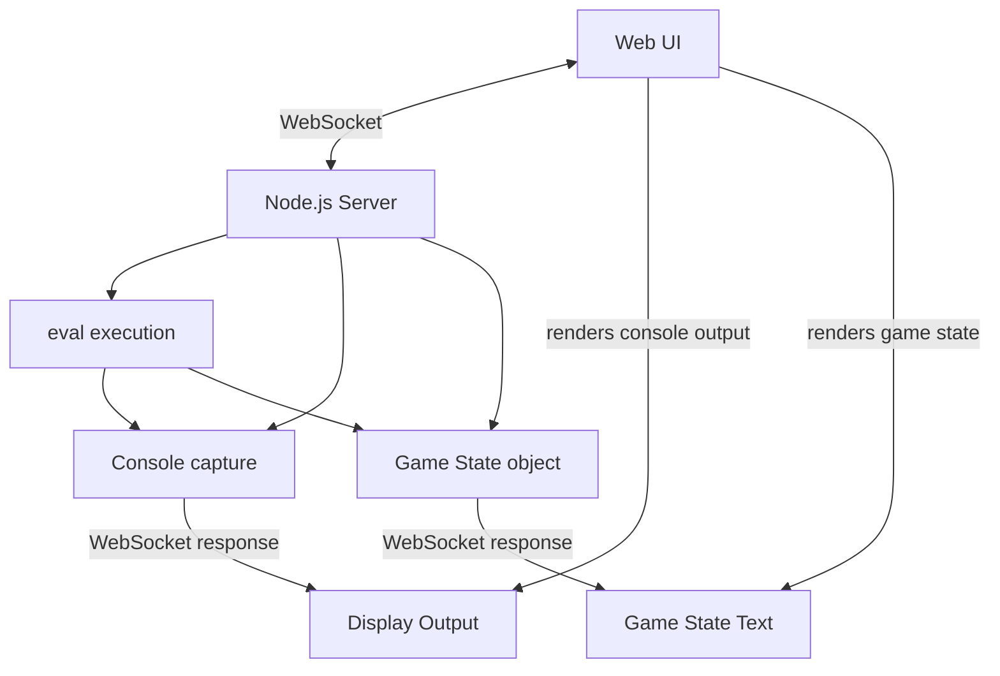

# Design: Code Execution POC

## Architecture Overview

Simple WebSocket-based client-server architecture for real-time code execution.



## Components

### 1. Web Client (`client.html`)
- Single HTML file with embedded CSS/JS
- **UI Elements:**
  - `<textarea>` for code input
  - `<div>` for console output display
  - `<div>` for game state display (text-based)
  - Submit button
- **WebSocket Client:** Connects to server, sends code, receives output

### 2. Node.js Server (`server.js`)
- **WebSocket Server:** Handles client connections
- **Code Execution:** Uses `eval()` to run received JavaScript
- **Console Capture:** Intercepts `console.log/error/warn` during execution
- **Game State:** Simple object that executed code can modify

## Data Flow

1. User types code in textarea
2. Client sends code via WebSocket: `{type: 'execute', code: 'console.log("hello")'}`
3. Server executes code with captured console output
4. Server sends results: `{type: 'output', console: ['hello'], gameState: {...}}`
5. Client displays console output and game state

## Implementation Details

### WebSocket Messages
```javascript
// Client → Server
{type: 'execute', code: string}

// Server → Client  
{type: 'output', console: string[], gameState: object}
{type: 'error', message: string}
```

### Console Capture
Override `console` methods during `eval()` execution to capture all output.

### Game State
Simple object exposed to executed code:
```javascript
// Available in executed code
gameState = {
  player: {x: 0, y: 0},
  world: "Starting area"
}
```

## File Structure
```
src/
  server.js        # WebSocket server + code execution
  client.html      # Complete UI in single file
  package.json     # Dependencies (ws for WebSocket)
```

## Dependencies
- `ws` - WebSocket library for Node.js
- No client-side dependencies (vanilla JS)
